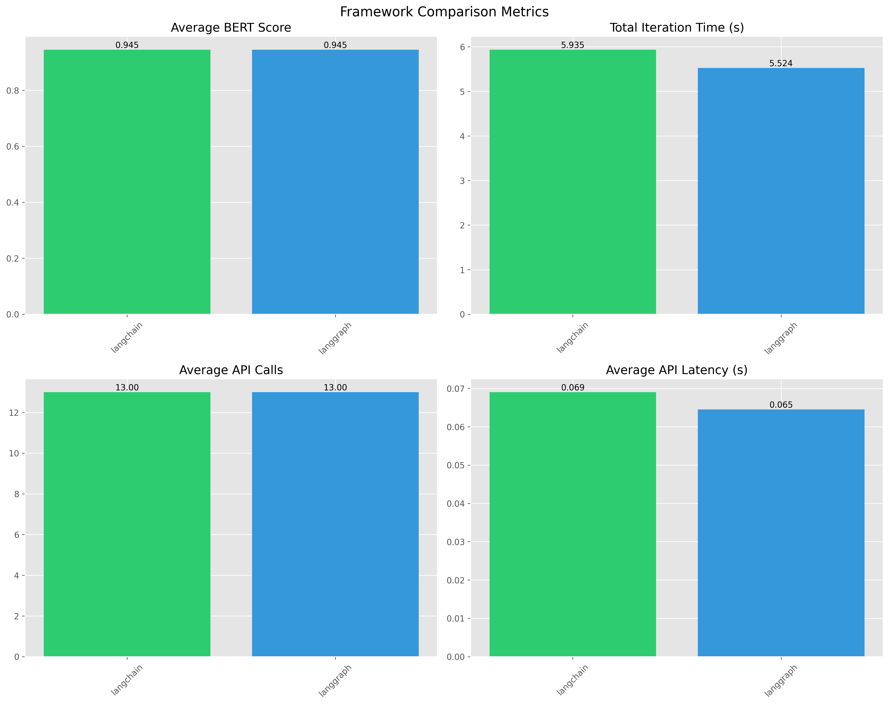

# Amazon Sales Agent Framework Benchmarking Tool

A tool for benchmarking different LLM agent frameworks (LangChain, LangGraph) on Amazon product query tasks.

## Overview

This application evaluates different agent frameworks by:
- Processing Amazon product data
- Handling various query types (price, rating, exploratory)
- Measuring performance metrics (BERT score, latency, API usage)
- Generating comparative visualizations

## Features

- **Multiple Agent Support**
  - LangChain
  - LangGraph
  - (Extensible for AutoGen and CrewAI)

- **Multiple LLM Support**
  - HuggingFace support (see config.yaml I used the model HuggingFaceH4/zephyr-7b-beta)
  - Groq support could be added

- **Multiple Data Sources**
- **Comprehensive Metrics**
  - BERT Score (semantic accuracy)
  - Total Iteration Time
  - API Call Count
  - API Latency

- **Data Management**
  - ChromaDB for vector storage
  - Efficient chunk retrieval
  - Duplicate handling
  - Data validation

The data directory contains amazon_cleaned.csv which is a subset of the total dataset from kaggle. There is a jsonl files which contains question, answer and question categories.

- simple agent benchmark/data/short_amazon_sales_examples.jsonl: Contains a handful of quetions (8) for demo purposes.

Categories of questions:
- price-related
- rating-related
- product-specific metadata
- exploratory

I have tested the price-related, rating-related and product-specific metadata an exploratory categories. There are only eight questions so that could be extended to a larger dataset. You will note the last question will force multiple chunks to be returned (there are multiple product in that category with the top rating) and the responses will be aggregated and passed to aggregate_results which will use the llm as a judge.

## Prerequisites

- Python 3.8+
- HuggingFace API key

## Installation

1. Clone the repository:
```bash
git clone <repository-url>
cd "simple agent benchmark"
```

2. Create a virtual environment:
```bash
python -m venv venv
source venv/bin/activate  # Linux/Mac
.\venv\Scripts\activate   # Windows
```

3. Install dependencies:
```bash
pip install -r requirements.txt
```

4. Set up environment variables:
```bash
cp .env.example .env
# Edit .env with your API keys
```

## Configuration

The application is configured via `config/config.yaml`:
- Model settings
- Data paths
- Logging preferences
- Benchmark parameters

## Usage

Run benchmarks with specific agents:
```bash
python main.py --agents langchain langgraph
```

Options:
- `--agents`: Frameworks to benchmark (langchain, langgraph, all)
- `--config`: Custom config file path
- `--output-dir`: Results directory

## Output

The tool generates:
1. Timestamped JSON metrics files
2. Visualization plots comparing frameworks
3. Detailed logs

## Project Structure

```
├── config/
│   └── config.yaml
├── src/
│   ├── agents/
│   │   ├── base.py
│   │   ├── langchain_agent.py
│   │   └── langgraph_agent.py
│   ├── data/
│   │   └── data_loader.py
│   ├── llm/
│   │   └── huggingface_provider.py
│   └── utils/
│       ├── metrics_collector.py
│       └── logging_config.py
├── tests/
└── main.py
```

## Testing

Run tests with:
```bash
pytest
```

Coverage report:
```bash
pytest --cov=src
```



### Metrics Breakdown:

1. **Average BERT Score** (Top Left)
   - LangChain: 0.945
   - LangGraph: 0.945

2. **Total Iteration Time** (Top Right)
   - LangChain: 5.935s
   - LangGraph: 5.524s (Faster overall execution)

3. **Average API Calls** (Bottom Left)
   - Both frameworks: 13.00 calls
   - Shows consistent API usage patterns

4. **Average API Latency** (Bottom Right)
   - LangChain: 0.069s
   - LangGraph: 0.064s
   - Minimal difference in API response times

*Note: Results may vary based on query complexity, data size, and network conditions.* 