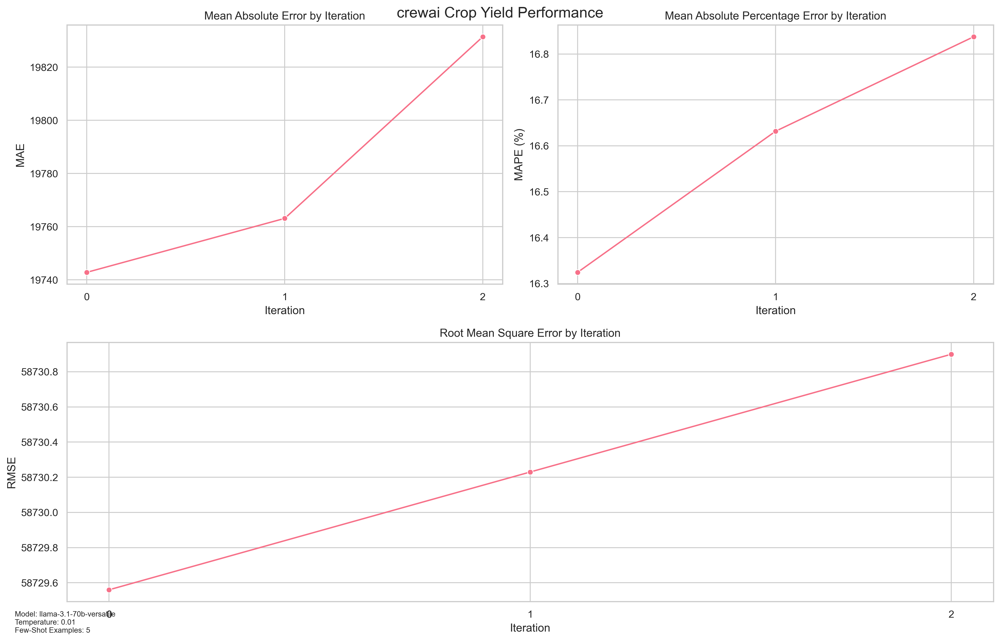
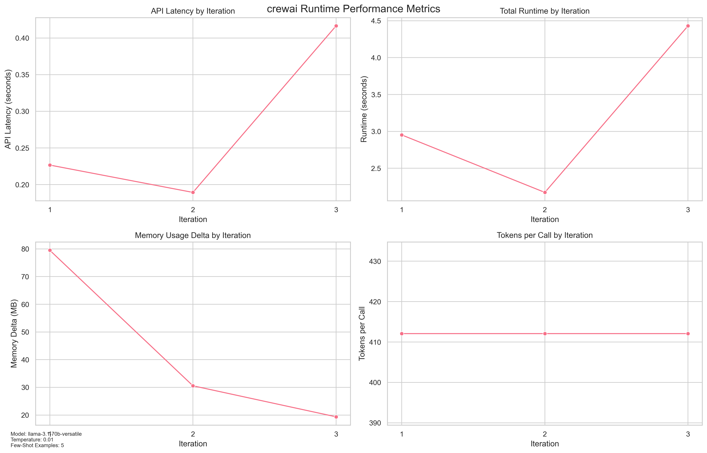

# Crop Yield Prediction Benchmark

A benchmarking framework for evaluating Large Language Model (LLM) performance on agricultural yield predictions using CrewAI architecture.

## System Architecture

The system uses a modular architecture with two main components:

1. **Core Application Components**
   - **Agents**
     - `PredictionAgent`: Handles yield predictions using LLM
     - `DataPreparationAgent`: Manages dataset preprocessing
   - **Tasks**
     - `PredictionTask`: Orchestrates prediction workflow
     - `DataPreparationTask`: Handles data cleaning and preparation
     - `QuestionLoadingTask`: Manages few-shot example selection

2. **Shared Components** (from simple_agent_common)
   - **Data Classes**
     - `CropDataset`: Encapsulates crop yield data and statistics
     - `CropPrediction`: Represents individual predictions
     - `Metrics`: Various metric tracking classes (LLM, Prediction, Benchmark)
   - **Utilities**
     - `TokenCounter`: Protocol for token counting implementation
     - Other shared utilities for data processing and metrics tracking

## Dependencies

The application relies on the following key dependencies:
- `simple_agent_common`: Common utilities and data classes shared across agent projects
- `crewai`: Framework for AI agent orchestration
- `langchain`: LLM integration tools

## Configuration (config.yaml)
```yaml
data:
  paths:
    crop_data: "data/crop+yield+predictiondata_crop_yield.csv" # Source dataset
    questions: "data/crop_yield_questions_10.jsonl" # Test questions
    env: "~/src/python/.env" # Environment variables
    metrics: "output/metrics" # Output directory
model:
  name: "llama-3.1-70b-versatile" # LLM model identifier
  temperature: 0.01 # Randomness control (lower = more deterministic)
  max_tokens: 1000 # Maximum response length
benchmark:
  iterations: 3 # Number of test iterations
  random_few_shot: false # Use random vs similarity-based examples
  num_few_shot: 5 # Number of examples per prediction
```

## Performance Metrics

### Prediction Performance (example_performance.png)


Tracks three key error metrics across iterations:
- **MAE (Mean Absolute Error)**: Average absolute difference between predicted and actual yields
- **MAPE (Mean Absolute Percentage Error)**: Percentage error relative to actual yields
- **RMSE (Root Mean Square Error)**: Square root of average squared errors

### Runtime Performance (example_runtime.png)


Monitors system performance:
- **API Latency**: LLM response time per call
- **Total Runtime**: Complete iteration processing time
- **Memory Delta**: Memory usage changes between iterations
- **Tokens per Call**: Token consumption rate

## Metrics Output

The system generates detailed JSON metrics for performance analysis and benchmarking. These metrics are standardized across agent projects using the common data structures from `simple_agent_common`.

Example output:
```json
{
  "model_name": "llama-3.1-70b-versatile",
  "model_temperature": 0.01,
  "model_max_tokens": 1000,
  "random_few_shot": false,
  "num_few_shot": 5,
  "iterations": [
    {
      "iteration": 1,
      "runtime": 2.9520063400268555,
      "memory_delta": 79.5,
      "peak_memory": 450.359375,
      "llm_calls": 10,
      "avg_latency": 0.22662765979766847,
      "total_prompt_tokens": 4121,
      "tokens_per_call": 412.1,
      "mae": 19742.8,
      "mape": 16.324332052010543,
      "rmse": 58729.56006135241
    },
    {
      "iteration": 2,
      "runtime": 2.172814130783081,
      "memory_delta": 30.5625,
      "peak_memory": 481.015625,
      "llm_calls": 10,
      "avg_latency": 0.18929717540740967,
      "total_prompt_tokens": 4121,
      "tokens_per_call": 412.1,
      "mae": 19763.1,
      "mape": 16.631760539429802,
      "rmse": 58730.22985226603
    },
    {
      "iteration": 3,
      "runtime": 4.430221080780029,
      "memory_delta": 19.359375,
      "peak_memory": 500.375,
      "llm_calls": 10,
      "avg_latency": 0.41660513877868655,
      "total_prompt_tokens": 4121,
      "tokens_per_call": 412.1,
      "mae": 19831.4,
      "mape": 16.83746420739134,
      "rmse": 58730.89960148746
    }
  ],
  "dataset_stats": {
    "Cocoa, beans": {
      "count": 39,
      "yield_stats": {
        "min": 5765.0,
        "max": 13056.0,
        "mean": 8883.128205128205
      }
    },
    "Oil palm fruit": {
      "count": 39,
      "yield_stats": {
        "min": 142425.0,
        "max": 203399.0,
        "mean": 175804.6923076923
      }
    },
    "Rice, paddy": {
      "count": 39,
      "yield_stats": {
        "min": 24686.0,
        "max": 42550.0,
        "mean": 32099.666666666668
      }
    },
    "Rubber, natural": {
      "count": 39,
      "yield_stats": {
        "min": 5249.0,
        "max": 10285.0,
        "mean": 7824.897435897436
      }
    }
  },
  "timestamp": "2025-01-13 09:47:18.930634"
}

