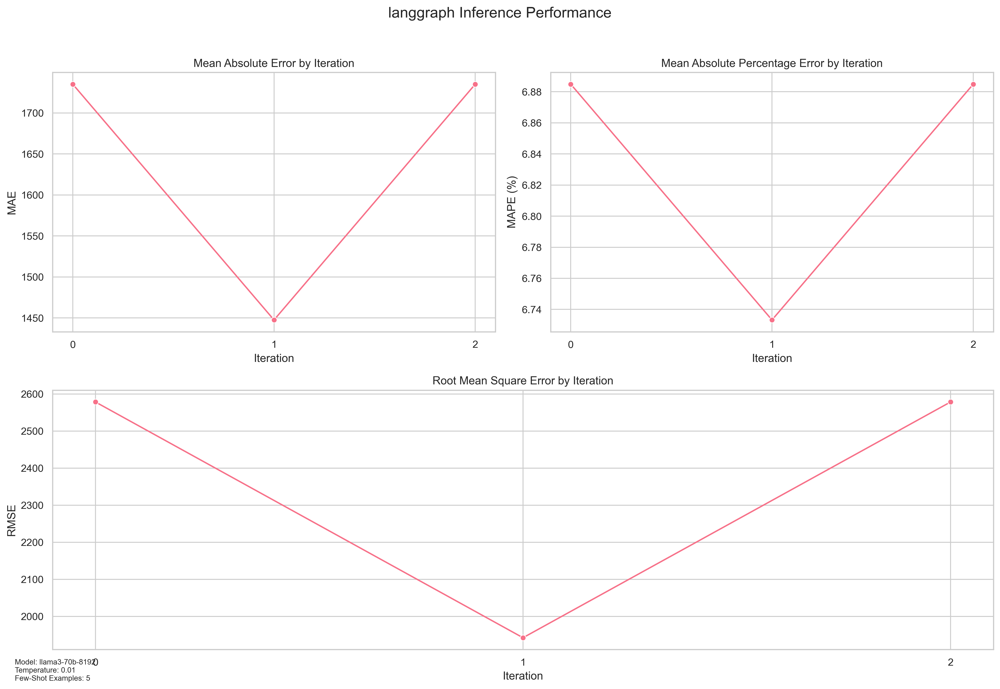
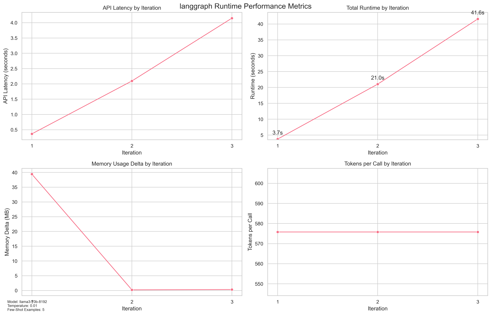

# Crop Yield Prediction Benchmark

A benchmarking framework for evaluating Large Language Model (LLM) performance on agricultural yield predictions using Langgraph architecture.

## System Architecture

The system uses a modular architecture with several key components:

### Core Components

1. **Agents**
   - `PredictionAgent`: Manages LLM interactions for yield predictions
     - Uses Langgraph's AssistantAgent for predictions
     - Handles context building with few-shot examples
     - Implements retry logic and error handling
   - `DataPreparationAgent`: Handles dataset management
     - Validates and cleans input data
     - Extracts features from questions
     - Manages data statistics and summaries

2. **Local Utilities**
   - `MetricsHandler`: Performance tracking and visualization
     - Tracks prediction accuracy (MAE, MAPE, RMSE)
     - Monitors system metrics (memory, runtime, API calls)
     - Generates performance visualizations
   - `ConfigLoader`: Configuration management
     - YAML configuration validation
     - Environment setup
   - `MemoryTracker`: Resource monitoring
     - Process memory tracking
     - Memory delta calculations

3. **Shared Components** (simple_agent_common)
   - Data Classes
     - `BenchmarkMetrics`: Overall benchmark statistics and saving functionality
       - Stores model configuration
       - Manages iteration results
       - Handles metrics file saving
     - `IterationMetrics`: Per-iteration measurements
       - Runtime tracking
       - Memory statistics
       - LLM call metrics
       - Token usage
       - Prediction accuracy
     - `PredictionMetrics`: Prediction accuracy metrics
       - Stores actual vs predicted values
       - Calculates MAE, MAPE, RMSE
       - Manages prediction statistics

   - Common Utilities
     - `RateLimiter`: Controls API call frequency
       - Max calls configuration
       - Pause time management
       - Context manager for rate limiting
     - `load_config()`: Configuration management
       - YAML file loading
       - Configuration validation
     - `load_env_vars()`: Environment setup
       - Loads .env files
       - Sets up API keys
     - `setup_logging()`: Logging configuration
       - Framework-specific logging
       - Debug and error tracking
     - `MemoryManager`: Memory tracking
       - Peak memory monitoring
       - Memory delta calculations
       - Process memory statistics

### Data Flow

1. **Initialization**
   - Load and validate configuration via simple_agent_common
   - Setup logging and environment
   - Initialize agents and shared utilities

2. **Benchmark Process**
   - Data preparation phase
     - Load and validate crop dataset
     - Process test questions
   - Iteration phase
     - Select few-shot examples (similarity/random)
     - Make predictions via Langgraph
     - Track performance using shared MetricsHandler
   - Metrics collection
     - Calculate error metrics using shared utilities
     - Monitor resource usage via MemoryTracker
     - Generate visualizations through MetricsHandler

### Performance Monitoring

1. **Prediction Metrics** (via simple_agent_common)
   - Error calculations per iteration
   - Aggregate statistics across runs
   - Standardized metrics collection

2. **System Metrics** (via simple_agent_common)
   - Memory usage tracking
   - API latency monitoring
   - Token consumption analysis

### Output Generation

1. **Metrics Output** (via simple_agent_common)
   - Detailed JSON reports
   - Performance visualizations
   - Runtime analysis graphs

2. **Logging**
   - Console and file logging
   - Debug information
   - Error tracking

## Configuration (config.yaml)
```yaml
data:
  paths:
    crop_data: "data/crop+yield+predictiondata_crop_yield.csv"
    questions: "data/crop_yield_questions_10.jsonl"
    env: "~/src/python/.env"
    metrics: "output/metrics"
model:
  name: "llama-3.1-70b-versatile"
  temperature: 0.01
  max_tokens: 1000
benchmark:
  iterations: 3
  random_few_shot: false
  num_few_shot: 5
```

## Performance Metrics

### Prediction Performance


Tracks three key error metrics across iterations:
- **MAE (Mean Absolute Error)**: Average absolute difference between predicted and actual yields
- **MAPE (Mean Absolute Percentage Error)**: Percentage error relative to actual yields
- **RMSE (Root Mean Square Error)**: Square root of average squared errors

### Runtime Performance


Monitors system performance:
- **API Latency**: LLM response time per call
- **Total Runtime**: Complete iteration processing time
- **Memory Delta**: Memory usage changes between iterations
- **Tokens per Call**: Token consumption rate

## Metrics Output

The system generates detailed JSON metrics:
```json
{
  "framework": "langgraph",
  "model_name": "llama3-70b-8192",
  "model_temperature": 0.01,
  "model_max_tokens": 1000,
  "random_few_shot": false,
  "num_few_shot": 5,
  "iterations": [
    {
      "iteration": 1,
      "runtime": 3.745771884918213,
      "memory_delta": 39.4375,
      "peak_memory": 273.1875,
      "llm_calls": 10,
      "avg_latency": 0.36518445014953616,
      "total_prompt_tokens": 5689,
      "tokens_per_call": 575.8,
      "mae": 1735.1,
      "mape": 6.884873921580588,
      "rmse": 2578.644934844656,
      "group_metrics": {}
    },
    {
      "iteration": 2,
      "runtime": 21.0457980632782,
      "memory_delta": 0.21875,
      "peak_memory": 273.515625,
      "llm_calls": 10,
      "avg_latency": 2.094681167602539,
      "total_prompt_tokens": 5689,
      "tokens_per_call": 575.8,
      "mae": 1447.5,
      "mape": 6.733231746496093,
      "rmse": 1942.52662787412,
      "group_metrics": {}
    },
    {
      "iteration": 3,
      "runtime": 41.58093214035034,
      "memory_delta": 0.328125,
      "peak_memory": 273.84375,
      "llm_calls": 10,
      "avg_latency": 4.14853138923645,
      "total_prompt_tokens": 5689,
      "tokens_per_call": 575.8,
      "mae": 1735.1,
      "mape": 6.884873921580588,
      "rmse": 2578.644934844656,
      "group_metrics": {}
    }
  ],
  "dataset_stats": {},
  "timestamp": "2025-03-09 15:07:34.233010",
  "memory_delta": 0.0,
  "peak_memory": 0.0,
  "benchmark_score": {
    "total_score": 84.39,
    "quality_percentage": 93.17,
    "speed_percentage": 55.58,
    "resource_percentage": 86.89,
    "details": {
      "quality_weight": 60,
      "speed_weight": 20,
      "resource_weight": 20,
      "quality_penalty": 1.0,
      "mape_ratio": 0.456,
      "runtime_variance": 239.165,
      "latency_variance": 2.391
    }
  }
}
```

### Usage Examples

```python
# Rate limiting
with self.rate_limiter:
    try:
        # Process all questions
        for idx, question in enumerate(state['questions']):
            features = question['features']
            dataset = state['dataset']

            context = self._build_prediction_context(features, dataset)
            prediction_result = self.predict_yield(features, context)

# Metrics handling
benchmark = BenchmarkMetrics(config=config)
iteration_result = IterationMetrics(
    iteration=iteration+1,
    runtime=runtime,
    memory_delta=memory_delta,
    peak_memory=peak_memory,
    llm_calls=llm_calls,
    avg_latency=avg_latency,
    total_prompt_tokens=total_prompt_tokens,
    tokens_per_call=tokens_per_call,
    mae=prediction_metrics.mae,
    mape=prediction_metrics.mape,
    rmse=prediction_metrics.rmse
)

# Configuration and setup
config = load_config()
load_env_vars(config)
logger = setup_logging(framework_name="Langgraph")

# Memory management
memory_manager = MemoryManager()
memory_manager.start_tracking()
memory_stats = memory_manager.get_memory_stats()